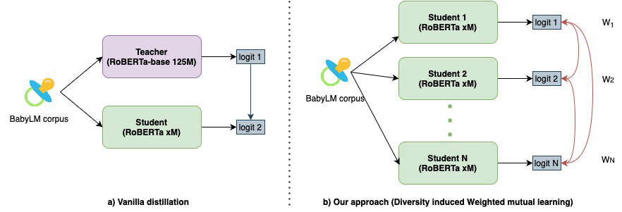

<h2 align="center"><b><h3>When Babies Teach Babies: Can student knowledge sharing outperform Teacher-Guided Distillation on small datasets?</h3></b></h2><br>


<p align="center">
  <b>Srikrishna Iyer</b>
</p>

<p align="center">
  <i>
    AI.DA STC, Group Technology Office<br>
    ST Engineering<br>
  </i>
</p>
<br>

<p align="center">
  <a href=""><b>Paper</b></a><br>
  <a href="https://huggingface.co/AI-DA-STC"><b>HuggingFace models</b></a>
</p>

<p align="center">
    
</p>

_______

<br>

This is the official repository for our paper about pre-training sample-efficient language models on a representative 10M and 100M text corpus. Our method builds upon deep mutual learning, introducing a student model search for diverse initialization. We address the limitation of treating students equally by formulating weighted mutual learning as a bi-level optimization problem. The inner loop learns compact students through online distillation, while the outer loop optimizes weights for better knowledge distillation from diverse students. This dynamic weighting strategy eliminates the need for a teacher model, reducing computational requirements. Our evaluations show that teacherless methods can match or surpass teacher-supervised
approaches.

_______

<br>

Training data
------------


Implementation details
------------

>Insert table summary on training details 


Setup
------------

**Create environment and install dependencies**

For macOS (Apple Chip):
```bash
$ mamba env create -f dependencies/babylm-conda-metal.yaml
```

For Linux :
```bash
$ mamba env create -f dependencies/babylm-conda.yaml
```

**Download data**

[Click here to download dataset](https://osf.io/ad7qg/) and save the dev, text, train_10M and train_100M to the `data/raw` folder


Project Organization
------------

    ├── LICENSE
    ├── Makefile           <- Makefile with commands like `make data` or `make train`
    ├── README.md          <- The top-level README for developers using this project.
    ├── data
    │   ├── external       <- Data from third party sources.
    │   ├── interim        <- Intermediate data that has been transformed.
    │   ├── processed      <- The final, canonical data sets for modeling.
    │   └── raw            <- The original, immutable data dump.
    │
    ├── docs               <- A default Sphinx project; see sphinx-doc.org for details
    │
    ├── models             <- Trained and serialized models, model predictions, or model summaries
    │
    ├── notebooks          <- Jupyter notebooks. Naming convention is a number (for ordering),
    │                         the creator's initials, and a short `-` delimited description, e.g.
    │                         `1.0-jqp-initial-data-exploration`.
    │
    ├── references         <- Data dictionaries, manuals, and all other explanatory materials.
    │
    ├── reports            <- Generated analysis as HTML, PDF, LaTeX, etc.
    │   └── figures        <- Generated graphics and figures to be used in reporting
    │
    ├── requirements.txt   <- The requirements file for reproducing the analysis environment, e.g.
    │                         generated with `pip freeze > requirements.txt`
    │
    ├── setup.py           <- makes project pip installable (pip install -e .) so src can be imported
    ├── src                <- Source code for use in this project.
    │   ├── __init__.py    <- Makes src a Python module
    │   │
    │   ├── data           <- Scripts to download or generate data
    │   │   └── make_dataset.py
    │   │
    │   ├── features       <- Scripts to turn raw data into features for modeling
    │   │   └── build_features.py
    │   │
    │   ├── models         <- Scripts to train models and then use trained models to make
    │   │   │                 predictions
    │   │   ├── predict_model.py
    │   │   └── train_model.py
    │   │
    │   └── visualization  <- Scripts to create exploratory and results oriented visualizations
    │       └── visualize.py
    │
    └── tox.ini            <- tox file with settings for running tox; see tox.readthedocs.io


--------

